# Overview

During my electrical engineering bachelor degree at Lille University of Science and Technology, we were asked to achieve and present a project made with an Arduino Uno board. I worked on this project in 2016 with my classmate and friend Anis Cerbah.

The subject we choose was to realize a device able to measure the snow depth with an ultrasonic component considering the temperature (having an impact on the sound speed and then on the measurement). Moreover a second board had to display the result of the snow depth on an LCD screen after a radio transmission between the two boards.

My role was mainly the development of the code for both boards, it was my first project as a developer. This is the original version of the code, I've just updated the comments in english. I also participated at the printed circuit boards Modelization with KiCad and helped with my knowledge in electronics.

You can find in this repository the source code for both boards, the tests, the libraries we used and also the KiCad files for PCB designs.

The project's goal had been completed with success and the jury congratulated us for our work.

# Table of Contents
- [Overview](#overview)
- [Table of Contents](#table-of-contents)
- [I - Device conception](#i---device-conception)
  - [1) Snow depth measurement](#1-snow-depth-measurement)
  - [2) Considering the temperature](#2-considering-the-temperature)
  - [3) Radio transmission](#3-radio-transmission)
  - [4) Result display](#4-result-display)
- [II - Components choice](#ii---components-choice)
  - [1) Arduino board](#1-arduino-board)
  - [2) ultrasonic module](#2-ultrasonic-module)
  - [3) Temperature sensor](#3-temperature-sensor)
  - [4) Radio emitter and receiver](#4-radio-emitter-and-receiver)
  - [5) LCD screen](#5-lcd-screen)
- [III - Realization](#iii---realization)
  - [1) Pins setup](#1-pins-setup)
    - [> First Arduino board](#first-arduino-board)
    - [> Second Arduino board](#second-arduino-board)
  - [2) Code development](#2-code-development)
    - [> First Arduino board](#first-arduino-board-1)
    - [> Second Arduino board](#second-arduino-board-1)
  - [3) Printed circuit boards designing](#3-printed-circuit-boards-designing)
    - [> Modelization with PCBNew](#modelization-with-pcbnew)
    - [> PCBs production](#pcbs-production)
  - [4) Testing the device](#4-testing-the-device)

# I - Device conception
## 1) Snow depth measurement

The first step when using the device is the measurement of the snow depth that will be noted *snowDepth*. For this fact, we will use a distance sensor, the device will be fixed at an altitude *height* which is fixed and known.

We will use an ultrasonic distance sensor whose principle is quite simple. Ultrasonic waves (incident waves) are sent perpendicular to a surface and when the medium changes, a part of the wave will be transmitted to the second medium while another part of the wave will be reflected in the first medium.

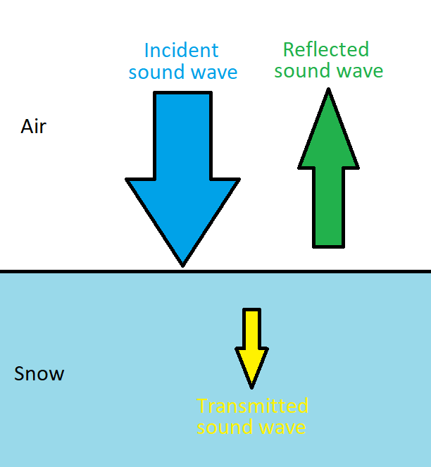

We can calculate the percentage of energy reflected during the change of medium thanks to the formula :

$`E\% = \frac{(Z2\ -\ Z1)^2}{(Z2\ +\ Z1)^2}`$

- Z1 corresponds to the acoustic impedance of the first medium, that of the air in our case.
- Z2 corresponds to the acoustic impedance of the second medium, that of the snow.

Calculation :

- $`Z1 = 430\ \ Pa.s/m`$
- $`Z2 = 0.75\ \ Pa.s/m`$

We then obtain E% = 99.3% of reflected energy, which is not surprising for a gas and a solid.

It is this reflected wave which interests us because by measuring the time between the sending of the incident wave and the reception of the reflected wave and knowing the speed of the acoustic waves, we can then find the distance traveled by the wave.

The formula used is the basic $`distance = speed \times time`$ but we must not forget to divide this distance by 2 because the wave travels twice the distance that we want to measure.

Furthermore the distance sensor does not directly measure the snow depth, it measures the distance separating the device and the snow (denoted *airDepth*). The depth of the snow is then calculated by subtracting the *height* by the measured distance *airDepth*.

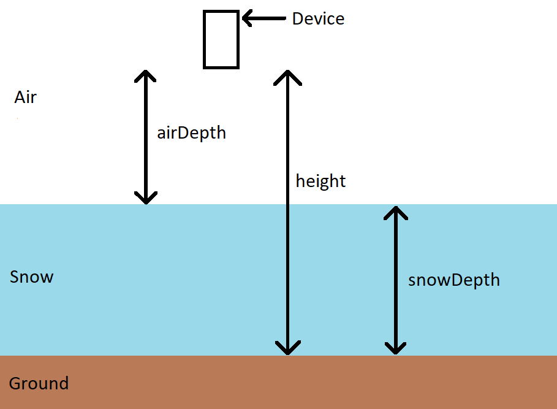

## 2) Considering the temperature

We want to improve the accuracy of our measurement, we know that the speed of acoustic waves depends on the temperature of the medium. Then we add to our device a temperature sensor that will calculate after measuring the temperature, the speed of sound in the air.

The speed of sound as a function of temperature is given by the following two formulas :

$`speed(\theta) = 331,3 \times \sqrt{1\ +\ \frac{\theta}{273,15}}`$

$`speed(\theta) = 20,05 \times \sqrt{\theta\ +\ 273,15}`$

Both formulas give the same result then we decided to use the first one.

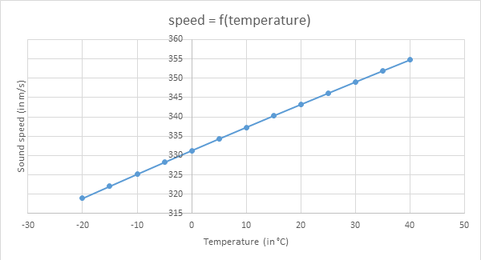

## 3) Radio transmission

After the various measurements and calculations made by the first board, it must then emit the result to the second board by radio transmission. For this radio transmission, we will use a emitter and a receiver both working with a 433 MHz frequency.

## 4) Result display

The last step is to display the result on a screen for the user. We will use an LCD display that works with an I²C bus to limit the number of wires and simplify wiring.

Indeed the I²C allows to communicate with only two wires :
- the SDA which makes it possible to send the information to be transmitted bit by bit
- the SCL which corresponds to the clock that is sent by the master to synchronize the communication. A bit is transmitted for each high level of the clock.

In addition, we will have to know the LCD display address to be able to transmit the information.

# II - Components choice

We have then established the following diagram for the realization of our project :

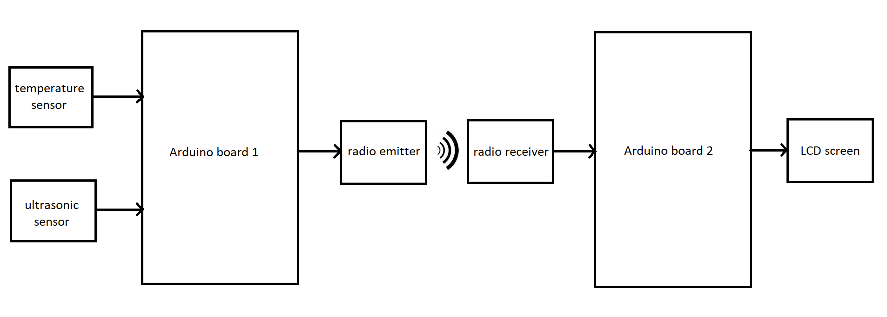

We will now have to choose the components we will use for the project's realization.

## 1) Arduino board

Arduino is an open source electronic board with a free development environment for interactive creation.

The board is a platform based on an input/output interface around the Atmel AVR microcontroller that can be easily programmed to analyze and generate electrical signals, to perform a variety of tasks.

A board contains all that is necessary for the operation of the microcontroller. Basically, it contains an AVR microcontroller powered by a power supply, a USB serial communication port and several input/output pins.

The power is supplied by means of the USB cable which connects the board to the microcomputer or with an AC adapter through a Jack connector. The connections to the input outputs are established through HE14 female connectors located on the top of the board.

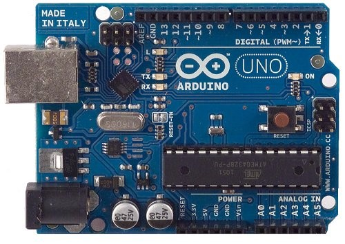

The Arduino module programming software is a multiplatform free application, an integrated development environment (IDE). It is a code editor and compiler, it also allows the user to transfer the firmware and program to the board.

The programming language used is the C ++ linked to the Arduino development library, allowing the use of the board and its inputs/outputs. The implementation of this standard language makes it easy to develop programs on Arduino platforms.

The transfer of the program to the board is done through an RS-232 serial interface, but through a USB port in most of the current boards. The microcontroller is preprogrammed with a "bootloader" (small boot program) that allows you to transfer the program into the microcontroller without having to use external programming equipment.

Advantages :

- It is simple and easy to implement
- The same board can be used in several projects
- The availability of a good number of libraries
- A strong online community that will answer to any questions
- The shields give a lot of possibilities to add components
- The IDE is multiplatform (Linux, Mac OS and Windows)

Disadvantages :

- The price is high compared to a microcontroller alone
- The microcontroller power is flanged by simple functions
- It cannot be programmed in assembler language
- The price of the shields is quite high in general

The Arduino Uno rev 3 board is a microcontroller board based on Atmel's ATMega328 microcontroller product running at 16 MHz. It is the most economical Arduino microcontroller board.

Details of the board :

- An ATMega328 microcontroller driven by a 16Mhz quartz
- 4 UART (hardware serial port)
- 14 digital input/output pins (6 of which can be used as PWM outputs (Pulse Width Modulation))
- 6 analog inputs
- USB connection for communication with a computer and for power supply
- A jack power connector
- Serial bus I²C and SPI
- A reset button

ATMega328 is an 8bit microcontroller produced by ATmel and based on the AVR architecture. It contains 32 KB flash memory, 1 KB EEPROM and 2KB RAM.

Each of the 14 digital pins on the Uno board operating at 5V and can be used either as a digital input or as a digital output. Arduino is an electronic board contains everything that is needed for the operation of the integrated microcontroller on the board.

The biggest advantage of an Arduino board is that it facilitates the task of the designer and simplifies the implementation of an electronic project, avoiding going through the soldering iron or circuit microcontroller programmer because the transfer the program is done directly through a USB cable.

## 2) ultrasonic module

For the distance sensor, we have chosen to use an ultrasonic module HC-SR04 which allows to simply measure a distance to the next surface.

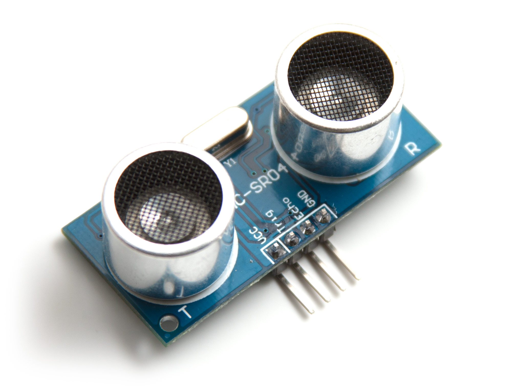

The HC-SR04 is a module composed of an ultrasonic emitter and an ultrasonic receiver. It allows the distance measurement by sending ultrasonic waves and receiving the reflections of these waves. The module measures in fact the time taken by the ultrasonic waves to come back after their emission and then it calculates the distance traveled by multiplying the time by the speed of sound at 20°C.

The module is composed of four pins, it must be powered in 5V on *VCC* and the *GND* pin must be connected to the ground of the Arduino board. The other two pins are used to communicate with the Arduino board to perform the measurement.

To trigger the start of the measurement, the Arduino board has to send a high level pulse for a minimum of 10 ms on the *Trig* pin of the HC-SR04.

When this signal is received, the module carries out the distance measurement by sending a signal at 40 kHz to the ultrasonic emitter and then retrieves the reflected waves using the ultrasonic receiver.

Once the measurement is done, the module sends on the *Echo* pin a high level pulse proportional to the traveled distance by the ultrasonic waves.

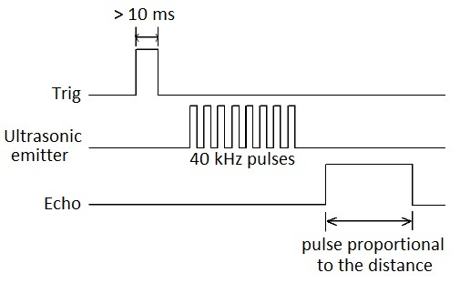

The signal received on the Echo pin is proportional to the measured distance, the width of the pulse must be measured in μs and must be divided by 58 to obtain the result in centimeters.

However, this module works for a maximum distance of 3 meters, which limit the device positioning. The distance between the device and the snow must be less than 3 meters.

## 3) Temperature sensor

The first criterion is that the temperature sensor must be able to measure negative temperatures since the purpose of the project is to measure a snow depth.

We have chosen the LM35CZ/NOPB which is an analog temperature sensor. It is composed of two power supply pins that will be powered by 5V and a *Vout* pin which is the analog output which sends the result of the measured temperature.

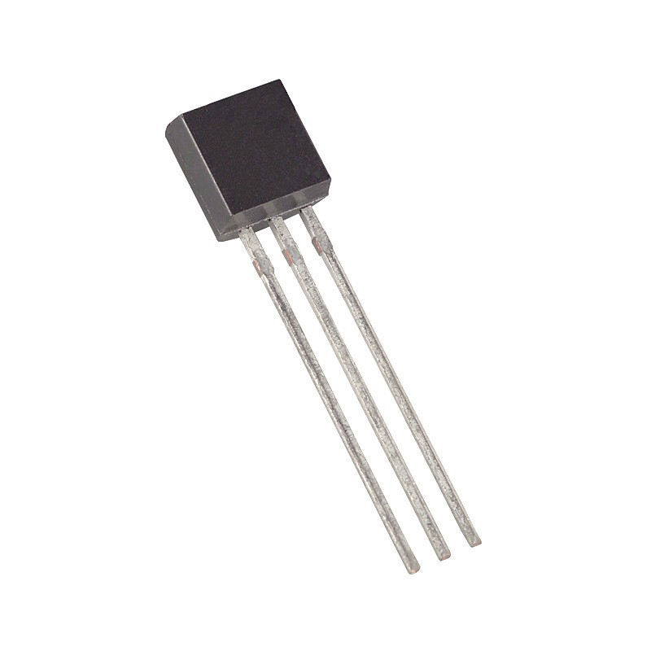

This temperature sensor has an accuracy of +/-0.75 °C, which is reasonable in the context of our project. The temperature sensor sends a voltage proportional to the temperature on the *Vout* pin : 

$`temperature = \frac{500\ \times\ Vout}{1024}`$

## 4) Radio emitter and receiver

We have chosen to use a radio communication at 433 MHz frequency to transmit the results from the first Arduino board to the second. We also have found a library named *VirtualWire* that will allow us to use the radio emitter and receiver.

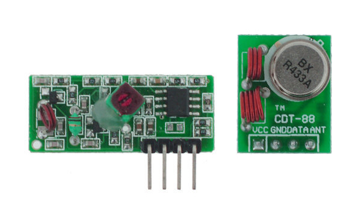

## 5) LCD screen

Regarding the LCD, we wanted to use a display compatible with the I²C protocol to simplify the wiring. We chose the MCCOG21605B6W-BNMLWI.

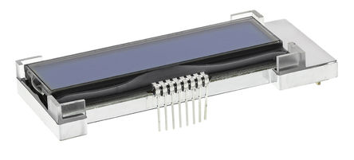

This display has two lines of 16 characters with a backlight that must be supplied with 5V on the anode and with a resistance of 4.7 kΩ placed between the cathode and the ground.

The display has 8 pins, in order from left to right in the image:
- pin 1 *Vout*
- pin 2 *CAPINT*
- pin 3 *CAPIP*
- pin 4 *VDD*
- pin 5 *VSS*
- pin 6 *SDA*
- pin 7 *SCL*
- pin 8 *RST*

We won't use the first 3 pins in our project, *VDD* and *VSS* correspond to the 5V power supply pins. *SDA* and *SCL* allow I²C communication to receive the information to display from the Arduino board and *RST* must also be connected to 5V for the display to work.

# III - Realization

## 1) Pins setup

We need now to define the pins that will be used to connect our different components to our two Arduino boards.

All the components will be powered by 5V, which means they will all be connected to the 5V pin and to the ground on the Arduino board to which they belong to.

### > First Arduino board

- The ultrasonic module's pins *Trig* and *Echo* to digital pins *4* and *5*
- The output *Vout* of the temperature sensor will be connected to the analog pin *A0*
- The *data* input of the radio emitter will be connected to the pin *12*

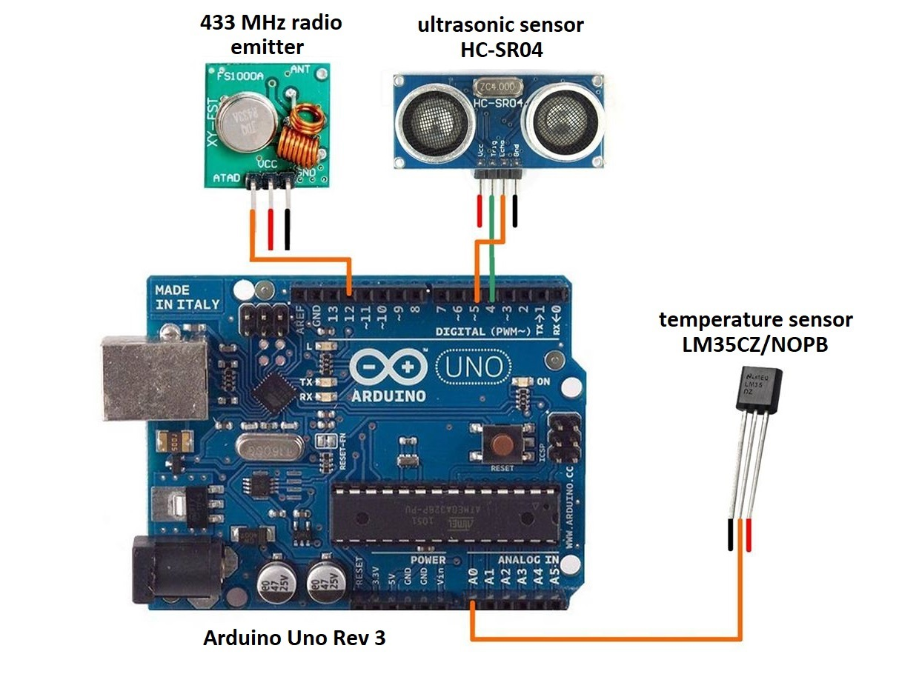

### > Second Arduino board

- The *RXD* output of the radio receiver will be connected to pin *11*
- For the LCD screen, the *SCL* and *SDA* pins will be connected to the equivalent pins on the Arduino board
- Also, the RST of the LCD must be connected to the 5V
- In addition, it is necessary to supply the backlight of the LCD by powering the anode and the cathode

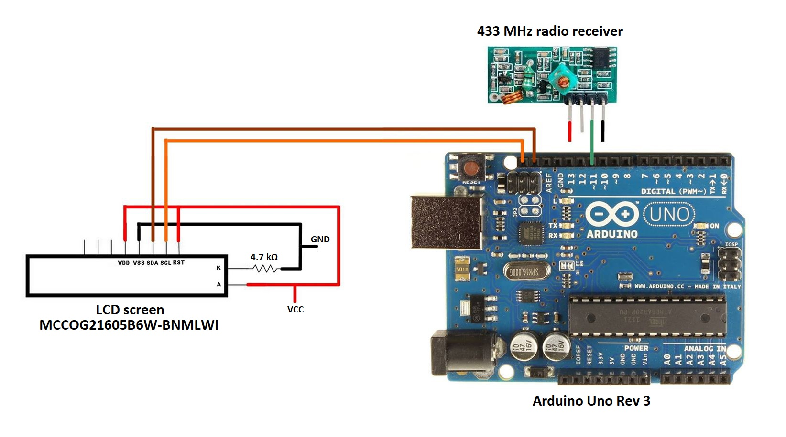

## 2) Code development

To develop the programs we used the official Arduino IDE that you can download on their [website](https://www.arduino.cc/).

### > First Arduino board

We can break down the programming of the first Arduino board in several steps :
- Initialize the device and the variables
- Measure the temperature with the sensor
- Calculate the sound velocity in function of the temperature
- Trigger the ultrasonic module to start the air depth measurement
- Receive the result from the module and convert it to centimeters
- Recalculate the real air depth with the sound velocity result
- Deduct the snow depth from air depth and height of the device
- Send the result in a message by radio transmission

### > Second Arduino board

We can do the same for the second Arduino board :
- Initialize the device and the variables
- Wait the first board to emit a radio message
- Receive the message containing the result
- Display the result on the LCD screen

## 3) Printed circuit boards designing

As part of our project, we decided to make two PCBs (printed circuit boards) to help us connecting the components to the Arduino boards.

The first step is to design both of the PCBs on a software. It is an important step as we need to think how we will arrange the different elements in an efficient way.

It is necessary to measure the components' size and design the circuit so as to place the copper tracks as simply as possible and avoiding conflicts.

### > Modelization with PCBNew

Once the design work completed, the printed circuit boards must be digitally modelled. For this, we used PCBNew, a tool contained in the KiCad software. You can download the software from [KiCad's website](http://kicad-pcb.org/).

It is necessary to create the footprint of the components thanks to the measurements carried out previously. It is also possible to download footprints already created by other users for the most popular components.

Once all the footprints are created or downloaded, we arrange the different components as we wish and we can begin to trace the copper tracks. Finally, we define the contours for both of the boards.

On the screenshot, you can see in green the copper tracks, in yellow the chips and the yellow frame delimiting the edges of the PCBs.

### > PCBs production

The first step of the PCBs production is to print on transparent paper the layer of our circuit boards called artwork :

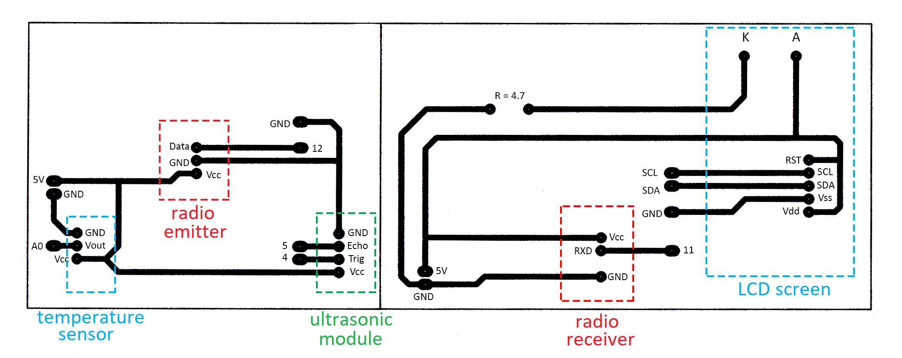

The colored frames and the annotations in this diagram are added for understanding and are not printed on the transparent paper when making printed circuits.

For the next steps we need a plate made of epoxy, copper and resin pre-sensitized to ultraviolet rays :

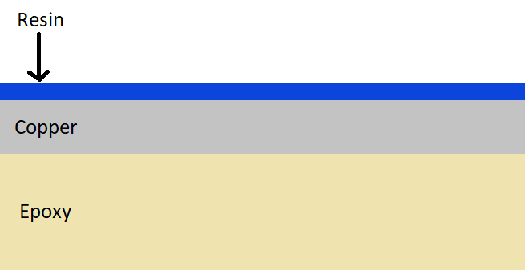

Then we go to the stage of insolation, for this we place the artwork and the plate in a machine, we insole the side of the resin by placing the artwork between the resin and the machine. We then make a mask with the artwork, it protects the resin that we want to keep.

Once the insolation is over, the next step is the revelation. This step involves dissolving the resin that has been exposed to ultraviolet light while preserving the unexposed resin. For this, the plate is tempered in a strong base.

Then comes the engraving, we eat away at the copper where the resin is no longer present. After that, the printed circuit boards are then cleaned with alcohol to remove the remaining resin and holes are drilled in the center of the chips to be able to pass pins and solder components.

Finally, all that remains is to solder the components on the printed circuits. We chose to use soldering bridges and not to solder the components directly, so we can disassemble the device to transport it more easily.

These pictures show the final result :

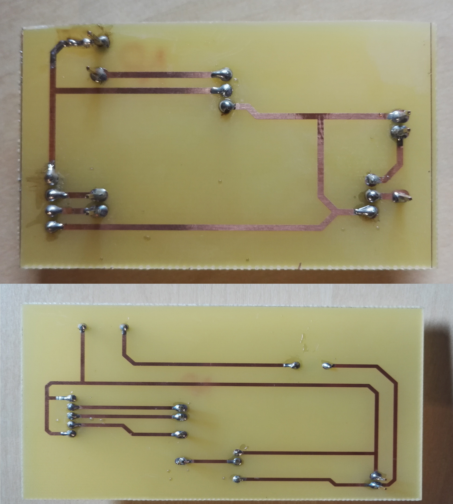

## 4) Testing the device

Now that everything is ready, all that remains is to test our entire device. As snow was not available, we tested the device with any fairly large solid obstacle placed perpendicular to the ultrasonic waves.

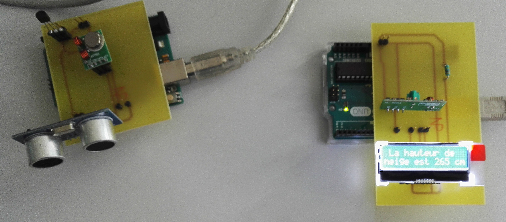

The LCD screen displays "La hauteur de neige est 265 cm", the english translation is "The snow depth is 265 cm".

The device works almost perfectly. Sometimes we get an error caused by the radio transmission that gives us an outlier but we programmed the LCD screen to display an error message in that case.